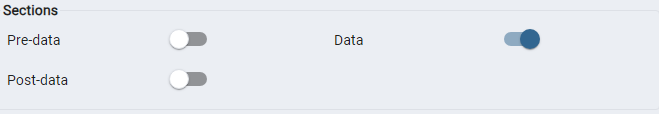

# Readme!

# 
### Start Application:
#### python version 3.7.3, 3.8
for start App use command 'docker compose up -d --build'

### Restoring db data:
for restore postgres backup choose file 'pg_data.backup' and press radiobox 'data' in restoring options:

and choose file with name 'pg_data.backup' in project directory.
### Sometimes you need to run the application container manually

# To view the API, go to your_IP/apidocs